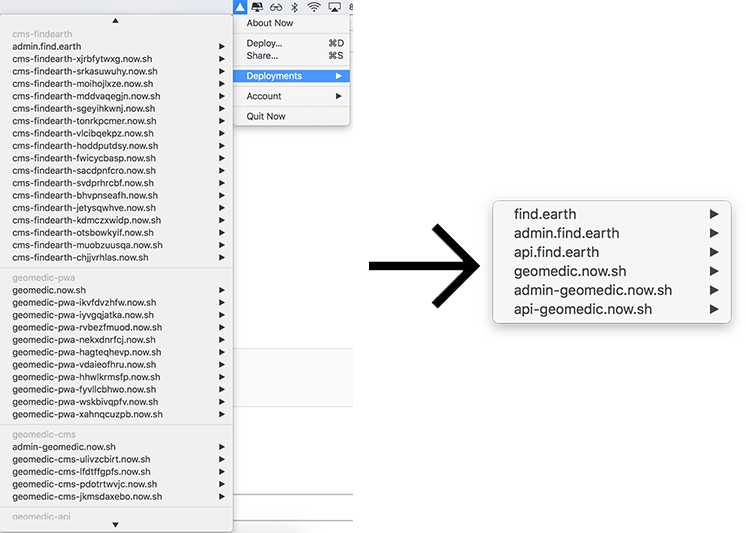

# now-purge [](https://www.npmjs.com/package/now-purge)

> Remove [now](https://zeit.co/now) deployments without an alias

<p align="center">
  
</p>

## CLI

### Installation

```bash
npm install -g now-purge
```

### Usage
```bash
now-purge <command> [options]

Commands:
  t  now token
  n  name in package.json or now.json to filter your deployments

Options:
  --team, -m     team id
  -h, --help     Show help                                             [boolean]
  -v, --version  Show version number                                   [boolean]
```

## As a package

### Installation

```bash
npm install now-purge --save
```

### Usage

```javascript
const nowPurge = require('now-purge')

// optional config parameters
const config = {
  token: 'YOUR_NOW_TOKEN',
  deploymentName: 'test',
  team: 'OPTION_TEAM_ID',
}

nowPurge(config)
```

## From your CI

You can remove your oldest deployments without an alias

```bash
npm install -g now-purge
now-purge -t YOUR_NOW_TOKEN -n YOUR_NOW_OR_PACKAGE_NAME --team OPTION_TEAM_ID
```


